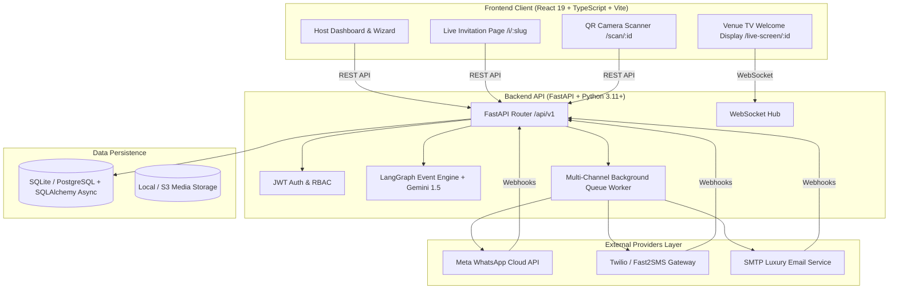

<div align="center">

# 🪔 Nimantran AI (निमंत्रण AI)
### **One Invitation. One Link. Entire Celebration.**

*Next-Generation AI-Powered Event Management, Luxury Digital Invitations & Multi-Channel Broadcasting Engine*

[](https://www.python.org/)
[](https://fastapi.tiangolo.com)
[](https://reactjs.org/)
[](https://www.typescriptlang.org/)
[](https://langchain.com/)
[](https://tailwindcss.com/)
[](LICENSE)

---

</div>

## 📖 Overview

**Nimantran AI** is a production-grade, full-stack celebration OS built specifically for modern Indian and multicultural celebrations (Weddings, Sangeet, Mehendi, Anniversaries, Birthdays, Housewarmings, Corporate Galas, and Festivals).

It replaces fragmented wedding planning workflows with an integrated, intelligent platform that automates event design, guest list curation, luxury digital cards, multi-channel messaging (WhatsApp, SMS, Email), live QR check-ins, and venue TV welcome screens.

---

## ✨ Key Features

### 1. 🤖 LangGraph Conversational AI Event Architect
- **Multi-Turn Stateful Planning Engine**: Chat with an AI wedding planner that understands regional traditions (North/South Indian, Marathi, Punjabi, Gujarati, Bengali, etc.).
- **Slot Filling & Event Generation**: Automatically generates multi-day itineraries, itineraries with muhurats, dress codes, and host details through natural language.
- **Dynamic Wording Synthesis**: Creates personalized Hindi, Sanskrit, and English invitation copy with traditional shlokas and blessings.

### 2. 🚀 Multi-Channel Invitation Broadcasting Engine
- **WhatsApp Cloud API Integration**: Dispatches rich media invitations and QR entry passes directly via Meta Graph API v21.0.
- **SMS / Text Gateways**: Integrated with Twilio and Fast2SMS (Indian DLT compliant).
- **Luxury Royal Email Cards**: High-aesthetic HTML email cards with shloka headers, venue map embeds, RSVP buttons, and calendar attachments.
- **Asynchronous Queue & Idempotency**: Built-in background rate-limiting, exponential backoff retries (3 attempts), and strict idempotency on `(campaign_id, guest_id, channel)` preventing duplicate dispatches.
- **Real-Time Delivery Dashboard**: Host-friendly KPIs (*Delivered, Sending, Waiting, Read, Failed*), guest delivery logs, and 1-tap retry for failed messages.

### 3. 💌 Interactive Live Guest Experience (`/i/:slug`)
- **Interactive Digital Cards**: Royal Indian theme engine (Rose Gold, Champagne, Emerald, Royal Marigold, Midnight Navy).
- **One-Tap RSVP Engine**: Real-time RSVP responses with dietary preferences, party size, and notes.
- **Live Google Maps & Itinerary**: Turn-by-turn navigation directly to the venue and event functions.
- **Digital Guest Wishes & Memory Wall**: Guests can leave blessings, upload celebration photos, and listen to background music.

### 4. 🎟️ Entry QR Pass & Scanner Dashboard
- **Unique Cryptographic Guest Passes**: Every guest receives a unique QR pass for VIP check-in.
- **Mobile Camera QR Scanner**: Fast, live camera scanner with sound/vibration feedback on check-in.
- **Real-Time Attendance Analytics**: Track arriving guest count, party size, and check-in timeline.

### 5. 📺 Big-Screen TV Welcome System (`/live-screen/:id`)
- **Live WebSocket Feed**: Real-time celebration screen designed for venue LED displays and TV lobby monitors.
- **Dynamic Guest Greeting**: When a guest scans in, the TV screen instantly welcomes them with animated photo cards and custom family quotes.

### 6. 👥 Master Contacts & Guest Management
- **Saved Master Contact Book**: Reusable family contact list with tagging, groups (Bride, Groom, VIP), and import/export.
- **Bulk CSV / Excel Import**: Smart phone normalization (E.164 standard) and deduplication.

---

## 🏗️ System Architecture



---

## 🛠️ Technology Stack

| Layer | Technologies |
| :--- | :--- |
| **Frontend** | React 19, TypeScript, Vite, Tailwind CSS, Lucide Icons, Canvas-Confetti, HTML5 QR Scanner |
| **Backend** | FastAPI, Python 3.11+, SQLAlchemy 2.0 (Async), Pydantic v2, Uvicorn, Asyncio |
| **AI & LLM** | LangGraph State Machine, LangChain, Google Gemini 1.5 Flash API |
| **Messaging** | Meta WhatsApp Cloud API (v21.0), Twilio REST API, Fast2SMS API, Python smtplib / aiosmtplib |
| **Database** | SQLite with `aiosqlite` (Default Dev) / PostgreSQL with `asyncpg` (Production) |
| **Security** | Passlib (Bcrypt), PyJWT (HMAC-SHA256), CORS Middleware, Strict Input Sanitization |

---

## 🚀 Quick Start Guide

### Prerequisites
- **Node.js** v18.0.0 or higher (`node -v`)
- **Python** 3.11 or higher (`python --version`)
- **Git**

---

### Step 1: Clone the Repository
```bash
git clone https://github.com/your-username/nimantran-ai.git
cd nimantran-ai
```

---

### Step 2: Backend Setup
1. Navigate to the `backend` directory:
   ```bash
   cd backend
   ```
2. Create and activate a Python virtual environment:
   ```bash
   # On macOS/Linux:
   python3 -m venv venv
   source venv/bin/activate

   # On Windows (PowerShell):
   python -m venv venv
   .\venv\Scripts\Activate.ps1
   ```
3. Install dependencies:
   ```bash
   pip install -r requirements.txt
   ```
4. Configure environment variables:
   ```bash
   cp .env.example .env
   ```
   *Edit `.env` to configure your `SECRET_KEY`, `GEMINI_API_KEY`, and provider settings.*
5. Run the backend server:
   ```bash
   uvicorn app.main:app --host 127.0.0.1 --port 8000 --reload
   ```
   Backend will be running at `http://127.0.0.1:8000`. Interactive Swagger API docs are available at `http://127.0.0.1:8000/docs`.

---

### Step 3: Frontend Setup
1. Open a new terminal and navigate to the `frontend` directory:
   ```bash
   cd frontend
   ```
2. Install npm dependencies:
   ```bash
   npm install
   ```
3. Start the Vite development server:
   ```bash
   npm run dev
   ```
   Frontend application will be live at `http://localhost:5173`.

---

## ⚙️ Environment Configuration (`.env`)

A sanitized template is provided in [.env.example](file:///.env.example):

```env
# Application Settings
PROJECT_NAME="Nimantran AI"
ENV=development
PORT=8000
PUBLIC_BASE_URL="http://localhost:5173"

# JWT Auth
SECRET_KEY="your-super-secret-jwt-key"
JWT_ACCESS_EXPIRE_MINUTES=1440

# Database URL (SQLite or PostgreSQL)
DATABASE_URL="sqlite+aiosqlite:///./nimantran.db"

# Google Gemini AI
GEMINI_API_KEY="your_gemini_api_key_here"

# Messaging Providers (set to 'mock' for local simulation)
WHATSAPP_PROVIDER_MODE="mock"
SMS_PROVIDER="mock"
EMAIL_PROVIDER="mock"
```

> [!NOTE]
> When `WHATSAPP_PROVIDER_MODE="mock"`, `SMS_PROVIDER="mock"`, and `EMAIL_PROVIDER="mock"`, the system runs an automated background delivery simulator with real database state updates without requiring external API keys.

---

## 🧪 Testing & Verification

Run automated unit and end-to-end integration tests:

```bash
cd backend
python -m pytest tests/test_broadcast_system.py tests/test_e2e_broadcasting.py -v
```

Typecheck the frontend:
```bash
cd frontend
npx tsc --noEmit
```

---

## 📁 Repository Structure

```
nimantran-ai/
├── backend/
│   ├── app/
│   │   ├── api/v1/endpoints/   # REST routes (auth, events, guests, campaigns, webhooks)
│   │   ├── core/               # App config, database, security, logging
│   │   ├── models/             # SQLAlchemy ORM models (Event, Guest, Campaign, User)
│   │   ├── schemas/            # Pydantic v2 schemas and validation
│   │   └── services/           # Business logic, LangGraph engine, worker, messaging providers
│   │       ├── whatsapp/       # Meta Cloud API & Simulator
│   │       ├── sms/            # Twilio & Fast2SMS Gateways
│   │       └── email/          # SMTP & Luxury HTML Email Engine
│   ├── tests/                  # Pytest automated test suites
│   ├── requirements.txt        # Python dependencies
│   └── .env.example            # Backend env template
├── frontend/
│   ├── src/
│   │   ├── components/         # Reusable UI components (Wizard, Dashboard, Modals, Cards)
│   │   ├── pages/              # Main routes (Dashboard, EventDetail, EventWizard, LiveScreen)
│   │   ├── services/           # Client API layer, sharing service
│   │   └── utils/              # Export utilities, theme engines
│   ├── package.json            # Node.js dependencies
│   └── vite.config.ts          # Vite build config
├── .gitignore                  # Master Git ignore (protects secrets, DBs, logs)
├── .env.example                # Root environment template
└── README.md                   # Project documentation
```

---

## 🔒 Security & Privacy Practices

- **Zero Secret Leakage**: All `.env`, `*.key`, `*.pem`, `*.db`, and token files are ignored in `.gitignore`.
- **HMAC Webhook Verification**: Meta WhatsApp webhooks require valid SHA-256 HMAC signature verification (`X-Hub-Signature-256`).
- **Atomic Idempotency**: Broadcast campaigns enforce deduplication tokens (`idempotency_key`) preventing double-billing or duplicate messages.
- **Password Hashing**: Modern Bcrypt hashing with salted iterations.

---

## 📄 License

This project is licensed under the [MIT License](LICENSE).

---

<div align="center">
  <b>Crafted with ❤️ for Celebrations Worldwide</b><br/>
  <i>Nimantran AI — Every Invitation Deserves Royalty.</i>
</div>
